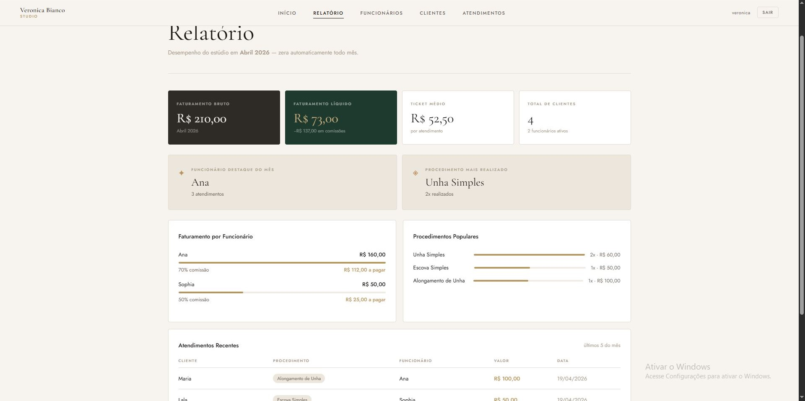
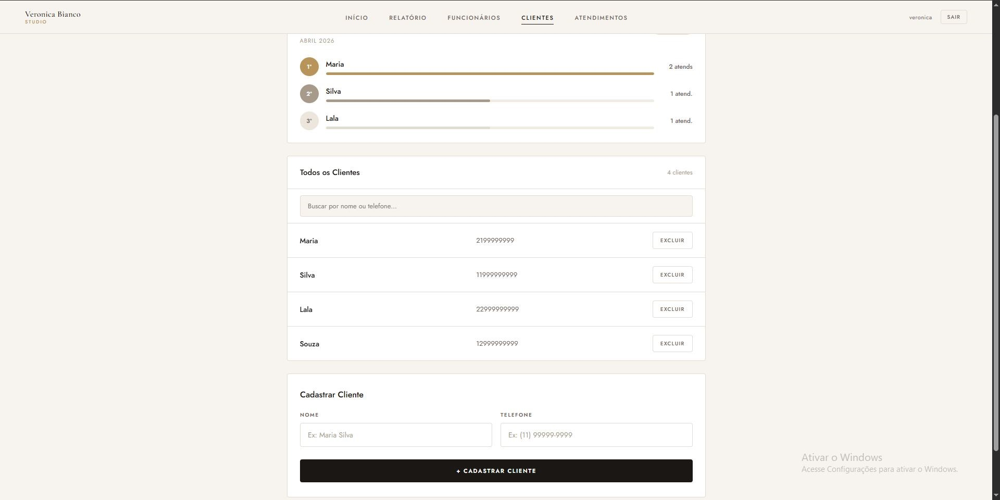

Desenvolvido com foco em organização, escalabilidade e boas práticas de arquitetura fullstack.

📸 Preview

🧠 Visão Geral

Aplicação fullstack composta por uma API REST em Node.js e um frontend em React. O sistema permite:

Gerenciamento de clientes e funcionários
Registro de atendimentos
Cálculo de comissões
Visualização de relatórios mensais

🏗️ Arquitetura

O backend segue o padrão de separação em camadas:

Controller → recebe requisições HTTP
Service → contém regras de negócio
Repository → acesso ao banco de dados

Essa abordagem facilita manutenção, testes e escalabilidade da aplicação.

🚀 Tecnologias
Backend
Node.js + Express
TypeScript
MongoDB + Mongoose
JWT (autenticação stateless)
bcryptjs (hash de senhas)
Frontend
React 18 + TypeScript
Vite
React Router DOM v6
Axios (com interceptors para autenticação)

📁 Estrutura do Projeto
/
├── backend/
│   └── src/
│       ├── controllers/
│       ├── services/
│       ├── repositories/
│       ├── models/
│       ├── middlewares/
│       ├── data/
│       ├── utils/
│       ├── routes.ts
│       ├── app.ts
│       └── server.ts
│
└── frontend/
    └── src/
        ├── api/
        ├── services/
        ├── pages/
        ├── components/
        ├── routes/
        ├── App.tsx
        └── index.css
⚙️ Funcionalidades
🔐 Autenticação
Login com usuário e senha
Token JWT com expiração
Rotas protegidas por autenticação
Redirecionamento automático ao expirar sessão
👩‍💼 Funcionários
Cadastro, listagem e remoção
Controle de comissão
Cálculo de ganhos por período
👥 Clientes
Cadastro e gerenciamento
Busca por nome ou telefone
Paginação de resultados
📅 Atendimentos
Registro de serviços realizados
Associação entre cliente e funcionário
Histórico completo com paginação
📊 Dashboard
Relatórios mensais automáticos
Faturamento bruto e líquido
Ticket médio
Ranking de desempenho
Indicadores de produtividade
🔌 API

Base URL definida via variável de ambiente.

🔐 Auth
Método	Rota	Descrição
POST	/auth/login	Autentica usuário
👩‍💼 Funcionários
Método	Rota	Descrição
GET	/employees	Lista todos
POST	/employees	Cria funcionário
GET	/employees/:id	Busca por ID
GET	/employees/:id/earnings	Ganhos totais
GET	/employees/:id/earnings/date	Ganhos por período
DELETE	/employees/:id	Remove

👥 Clientes
Método	Rota	Descrição
GET	/clients	Lista todos
GET	/clients/search	Busca
POST	/clients	Cria cliente
GET	/clients/:id	Busca por ID
DELETE	/clients/:id	Remove

📅 Atendimentos
Método	Rota	Descrição
GET	/appointments	Lista todos
POST	/appointments	Cria atendimento
GET	/appointments/:id	Busca por ID
DELETE	/appointments/:id	Remove

🔐 Segurança
Senhas armazenadas com hash (bcrypt)
Autenticação via JWT
Rotas protegidas por middleware
Variáveis sensíveis isoladas em .env
Preparado para uso com HTTPS em produção
